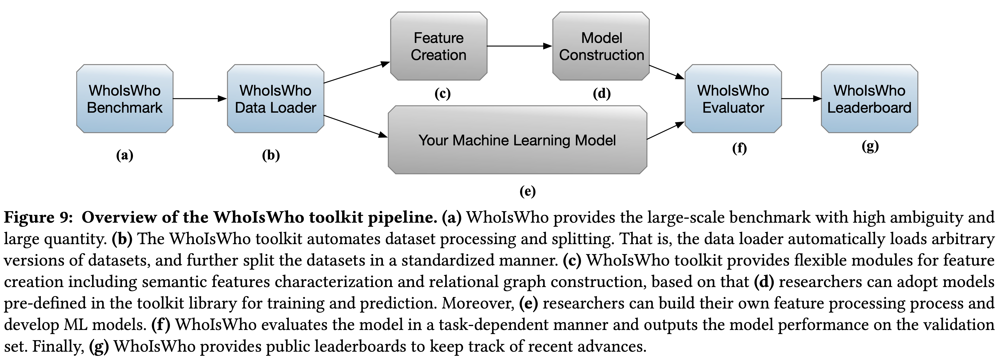

# WhoIsWho Toolkit
**TL;DR**: By automating data loading, feature creation, model construction, and evaluation processes, the WhoIsWho toolkit is easy for researchers to use and let them develop new name disambiguation approaches.

The toolkit is fully compatible with PyTorch and its associated deep-learning libraries, such as Hugging face. Additionally, the toolkit offers library-agnostic dataset objects that can be used by any other Python deep-learning framework such as TensorFlow.  

## Overview



## Install

```
pip install whoiswho
```


## Pipeline

The WhoIsWho toolkit aims at providing lightweight APIs to facilitate researchers to build SOTA name disambiguation algorithms with several lines of code. The abstraction has 4 components:
* **WhoIsWho Data Loader**: Automating dataset processing and splitting. 

* **Feature Creation**: Providing flexible modules for extracting and creating features.

* **Model Construction**: Adopting pre-defined models in the toolkit library for training and prediction.

* **WhoIsWho Evaluator**: Evaluating models in a task-dependent manner and output the model performance on the validation set.


### Commands
Input the name of the dataset and task type as well as the dataset category and features to be used for name disambiguation. For example:

```shell
python -u demo.py --task rnd --name v3 --type train valid test --feature adhoc oagbert graph
```

With a pipeline design based on four components, you can clearly implement name disambiguation algorithms. The predict result is stored in './whoiswho/training/{**task**}_result '.

```python
def pipeline(name: str , task: str ,type_list: list, feature_list: list):
    version = {"name": name, "task": task}
    if task == 'RND':
        # Module-1: Data Loading
        download_data(name,task)
        # Partition the training set into unassigned papers and candidate authors
        processdata_RND(version=version)

        # Modules-2: Feature Creation
        generate_feature(version,
                         type_list = type_list,
                         feature_list = feature_list)

        # Module-3: Model Construction
        trainer = RNDTrainer(version,simplified=False,graph_data=True)
        cell_model_list = trainer.fit()
        trainer.predict(whole_cell_model_list=cell_model_list,datatype='valid')

        # Modules-4: Evaluation
        # Please uppload your result to http://whoiswho.biendata.xyz/#/

    if task == 'SND':
        # Module-1: Data Loading
        download_data(name, task)
        processdata_SND(version=version)

        # Modules-2: Feature Creation & Module-3: Model Construction
        trainer = SNDTrainer(version)
        trainer.fit(datatype='valid')

        # Modules-4: Evaluation
        # Please uppload your result to http://whoiswho.biendata.xyz/#/
```


### NA_Demo

To enable users to quickly reproduce name disambiguation algorithms, the project provides a small dataset NA_Demo based on WhoIsWho v3. Under each author name in the training set, there are more than 20 authors with the same name.

Under the Real-time Name Disambiguation(RND) task, the time costs of NA_Demo and WhoIsWho v3 are as follows:

<table>
  <tr>
    <th><center>Module</center></th>
    <th><center>Operation</center></th>
    <th><center>NA_Demo(train+valid)</center></th>
    <th><center>whoiswho_v3(train+valid+test)</center></th>
  </tr>
  <tr>
    <td rowspan="3"><center><b>Feature Creation</b></center></td>
    <td ><center>Semantic Feature(soft)</center></td>
    <td ><center>20min</center></td>
    <td ><center>5h</center></td>  
  </tr>
  <tr>
    <td ><center>Semantic Feature(adhoc)</center></td>
    <td ><center>14min</center></td>
    <td ><center>1h23min</center></td>
  </tr>
  <tr>
    <td ><center>Relational Feature(ego)</center></td>
    <td ><center>--</center></td>
    <td ><center>2h22min</center></td>
  </tr>
  <tr>
    <td rowspan="2"><center><b>Model Construction</b></center></td>
    <td ><center>RNDTrainer.fit</center></td>
    <td ><center>10min</center></td>
    <td ><center>1h</center></td>
  </tr>
  <tr>
    <td ><center>RNDTrainer.predict</center></td>
    <td ><center>1min</center></td>
    <td ><center>37min</center></td>
  </tr>
  <tr>
		<td colspan="2"><center><b>Spend Time</b></center></td>
		<td ><center>45min</center></td>
		<td ><center>8~10h</center></td>
  </tr>
  <tr>
		<td colspan="2"><center><b>Weighted-F1(%)</b></center></td>
		<td ><center>98.64%</center></td>
		<td ><center>93.52%</center></td>
  </tr>
</table>
Under the From-scratch Name Disambiguation(SND) task, the time costs of NA_Demo and WhoIsWho v3 are as follows:

<table>
  <tr>
    <th><center>Module</center></th>
    <th><center>Operation</center></th>
    <th><center>NA_Demo(train+valid)</center></th>
    <th><center>whoiswho_v3(train+valid+test)</center></th>
  </tr>
  <tr>
    <td rowspan="2"><center><b>Feature Creation</b></center></td>
    <td ><center>Semantic Feature</center></td>
    <td ><center>1min</center></td>
    <td ><center>7min</center></td>  
  </tr>
  <tr>
    <td ><center>Relational Feature</center></td>
    <td ><center>3min</center></td>
    <td ><center>2h40min</center></td>
  </tr>
  <tr>
    <td rowspan="2"><center><b>Model Construction</b></center></td>
    <td ><center>SNDTrainer.fit</center></td>
    <td ><center>3s</center></td>
    <td ><center>10s</center></td>
  </tr>
  <tr>
    <td ><center>SNDTrainer.predict</center></td>
    <td ><center>1s</center></td>
    <td ><center>20s</center></td>
  </tr>
  <tr>
		<td colspan="2"><center><b>Spend Time</b></center></td>
		<td ><center>4min</center></td>
		<td ><center>2~3h</center></td>
  </tr>
  <tr>
		<td colspan="2"><center><b>Pairwise-F1(%)</b></center></td>
		<td ><center>98.30%</center></td>
		<td ><center>89.22%</center></td>
  </tr>
</table>
We provide SND and RND evaluation method for the valid set in  './whoishwho/evaluation',  you can directly evaluate the prediction results on the valid set. 

If you wish to do more extensive experiments, you can obtain the full WhoIsWho v3 dataset. Our preprocessed NA_Demo already provides a representative subset for initial exploration.


## Preliminary Document

### NA_Demo.tar.gz

Download: https://pan.baidu.com/s/169-dMQa2vgMFe7DUP-BKyQ   Password: 9i84

If you want to quickly try pipeline by NA_Demo dataset:

1. Download our NA_Demo dataset

2. Unzip it to the data folder './whoiswho/dataset/data/'.

3. Run the provided baseline code

4. Check the evaluation results on the valid set

This will allow you to quickly reproduce state-of-the-art name disambiguation algorithms on a small demo dataset.


### whoiswho_toolkit_data

Download: https://pan.baidu.com/s/1q6-v0FF9M9LMvXNaynfyJA     Password: 2se6

Here is an introduction to the preprocessed data we have prepared for you. You can decide whether to download it based on your needs:

**saved.tar.gz**   

This is the necessary file for RND and SND, including tf-idf, oagbert model and other data. Unzip it to './whoiswho/'.

**processed_data.tar.gz**  

The RND data processed in whoiswho v3, you can get this data in **<u>processed_RND</u>** in pipeline. If you want to use this data, execute **<u>download_data</u>** in pipeline and unzip it to './whoiswho/dataset/data/v3/RND/'.

**graph_data.tar.gz**  &  **graph_embedding**

Ego-graphs constructed for papers and authors in whoiswho v3. If graph information needs to be added to RND task of whoiswho v3, unzip graph_data.tar.gz to './whoiswho/dataset/data/v3/RND/'.

The graph_embedding.tar  is too big and we split it into multiple parts, run the following command to merge graph_embedding.tar.* and decompress it:

```shell
cat graph_embedding.tar.* |tar -x  
```

**whoiswhograph_extend_processed_data.tar.gz**

If graph information needs to be added to RND task of whoiswho v3, unzip whoiswhograph_extend_processed_data.tar.gz to './whoiswho/dataset/data/v3/RND/'.


### whoiswho_toolkit_feature

Download: https://pan.baidu.com/s/1phxvyKI5p3r-drx3tAysYA    Password: h1ea

We provide hand, oagbert, graph features for the RND task of whoiswho v3. If you want to save time,  directly load these features  to your NA model. You can also get these features in **<u>generate_feature</u>** in pipeline.

If you want to generate your own graph feature, remember to put **gat_model_oagbert_sim.pt** in the

'./whoiswho/featureGenerator/rndFeature/'. You can train **gat_model_oagbert_sim.pt** on your own with the following command:

```python
cd ./whoiswho/featureGenerator/rndFeature/
python graph_dataloader.py
python graph_model.py
```


