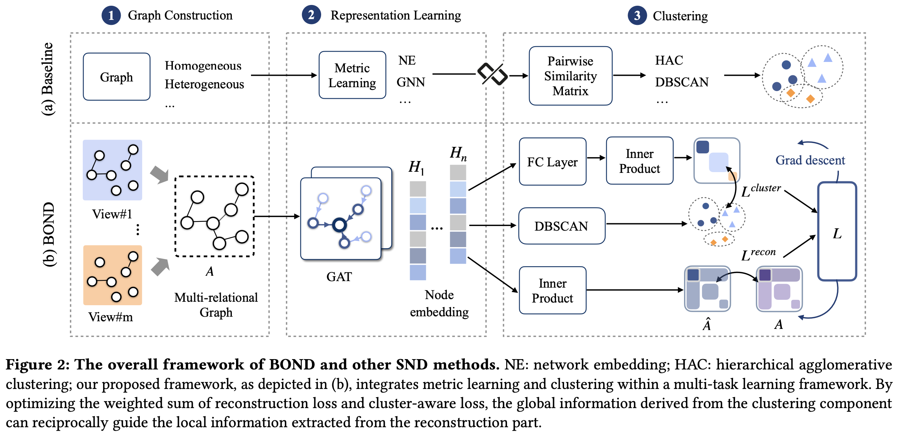

# BOND
This repository contains the source code of paper "BOND: Bootstrapping From-Scratch Name Disambiguation with Multi-task Promoting".



## Usage

### Data preparation

The datasets WhoIsWho can be downloaded from: [Dataset](https://www.aminer.cn/whoiswho)

Paper embedding can be downloaded from: [Embedding](https://pan.baidu.com/s/1A5XA9SCxvENM2kKPUv6X4Q?pwd=c9kk )
Password: c9kk

Download dataset "src" and embedding "paper_emb", organize in directory "dataset" as follows:

```
    .
    ├── dataset
        ├── data
            ├── paper_emb
            └── src
```

### One-line Command
Execute the following command. You can freely choose the data type(train/valid/test) by '--mode train/valid/test'. Post-matching is performed by default, you can control this operation by '--post_match True/False':
```
python demo.py --post_match True --mode train
```

It will do name disambiguation with clearly designed pipeline, you can choose model BOND or BOND+ by the parameter 'model':
```
def pipeline(model):
    # Module-1: Data Loading
    dump_name_pubs()
    dump_features_relations_to_file()
    build_graph()

    # Modules-2: Feature Creation & Module-3: Model Construction
    if model == 'bond':
        trainer = BONDTrainer()
        trainer.fit(datatype=args.mode)
    elif model == 'bond+':
        trainer = ESBTrainer()
        trainer.fit(datatype=args.mode)

    # Modules-4: Evaluation
    # Please uppload your result to http://whoiswho.biendata.xyz/#/

```

The output will be stored in 'bond/out'. To evaluate, please upload your result to http://whoiswho.biendata.xyz/#/.


### (Optional) Generate node embeddings

To initialize graph nodes with embeddings, a **pretrained embedding** is provided above. Alternatively, you can generate custom **Word2Vec embeddings** by training a model on the dataset.  

Run the following commands to preprocess the dataset and train the model:  

```bash
python dataset/preprocess_SND.py 
python train_w2v.py
```

Once training is complete, the embeddings will be saved at:

```
dataset/data/paper_emb
```

You can then use these embeddings to initialize your graph.

## Implementation requirements

```
    gensim==4.3.0
    matplotlib==3.7.1
    numpy==1.24.3
    pandas==1.5.3
    pinyin==0.4.0
    scikit-learn==1.2.2
    scipy==1.10.1
    torch==1.12.1
    torch-geometric==2.2.0
    tqdm==4.65.0
```

## References
🌟 If you find our work helpful, please leave us a star and cite our paper.
```
@inproceedings{cheng2024bond,
  title={BOND: Bootstrapping From-Scratch Name Disambiguation with Multi-task Promoting},
  author={Cheng, Yuqing and Chen, Bo and Zhang, Fanjin and Tang, Jie},
  booktitle={Proceedings of the ACM on Web Conference 2024},
  pages={4216--4226},
  year={2024}
}
```
